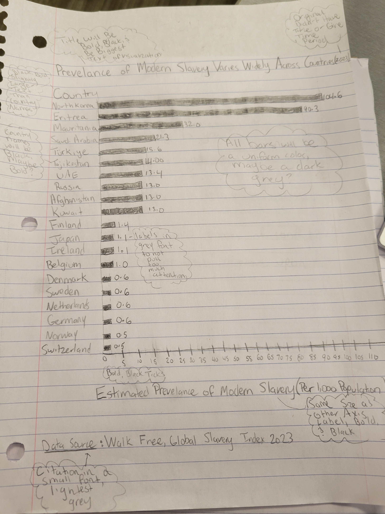

| [Home](https://mbireley.github.io/mary-bireley-portfolio/) | [Data Visualization Examples](dataviz-examples.html) | [Critique by Design](critique-by-design.html) | [Final Project I](final-project-part-one.html) | [Final Project II](final-project-part-two.html) | [Final Project III](final-project-part-three.html) |

# Critique By Design

Here is an assignment I did called "Critique by Design." I chose a visualization from a website called Makeover Monday, and I had to critique it, sketch a possible redesign, get targeted feedback from my peers, and create a final redesign in Tableau. Below you can read about each step I took, and at the end you will see my finished visualization!

## Step One: The Visualization I Chose to Redesign

This is the visualization I chose to redesign. You can find it on the Makeover Monday site [here](https://makeovermonday.vercel.app/dataset/2024w47-global-slavery-index). This visualization is part of an [article](https://www.walkfree.org/global-slavery-index/#:~:text=An%20estimated%2050%20million%20people,10%20million%20people%20since%202016) from Walk Free, a human rights organization focused on modern day slavery. The visualization was created from Walk Free's data source, "Global Slavery Index 2023." The data set can be viewed [here](https://www.walkfree.org/global-slavery-index/downloads/). 

 

I chose this visualization because I felt the topic of the data itself was very important from a social justice and human rights standpoint. Modern day slavery is an issue that is more prevalent than most people imagine. Therefore, visualizations of this data need to be designed in such a way that viewers easily and quickly understand not only the high prevalence of slavery across the world, but also the significant gaps in prevalence that exist between countries. I felt that in its original iteration, this visualization failed to properly or clearly communicate this data and its important story, and therefore failed to raise the necessary awareness, leading me to want to redesign it. 

## Step Two: The Critique

As we learned in our Good Charts textbook critique method, I first noted what my eyes were initially drawn to. In this case, my eyes were first drawn to the red boxes signifying the slavery prevalence rates in the “least prevalent countries.” My eyes were also drawn to the bold text on the visualization. 

To critique the chart further, I followed Stephen Few’s "Data Visualization Effectiveness Profile" and ranked this visualization in the following ways:

 

 The visualization succeeded best in usefulness. I ranked the visualization highly in usefulness because the information provided was important, not just on a societal level, but also for the audience specifically, who could benefit from the awareness this visualization raises. The visualization was also successful, though less so, in intuitiveness because visual rankings are easily understood by readers, who know that the countries on top are those ranked highest. However, the visualization does not utilize intuitive colors; the red color (which my eyes were first drawn to) of the “least prevalent countries” is counterintuitive, as red is associated with negativity (and less slavery is certainly not a negative).

The visualization was less successful in the following areas: completeness, perceptibility, and truthfulness. 

I ranked the visualization lower in completeness for two main reasons. First, the visualization does not have a title, or other important details (like time period) so readers may not have the context necessary to immediately understand what is being communicated to them. Additionally, the visualization may have unnecessary information. The countries are ranked on prevalence, suggesting this is the main focus of the story, to compare the rates of the countries with the most prevalence against those with the least. However, the visualization also includes the actual number of enslaved people in each country, which does not necessarily correlate to the country’s ranking. This inclusion might confuse viewers or distract from the story. I also ranked the visualization lower in truthfulness, as it makes claims that are not actually proven or shown by the visualization. The creators included textboxes that list characteristics the countries on the opposing ends of the spectrum “tend to have,” but the visualization itself doesn’t depict evidence to support these ideas. I was also concerned about the perceptibility of the visualization because readers need to go between two different tables in order to make any sort of comparisons, requiring more effort. 

I felt the visualization was neutral in the remaining categories of aesthetics and engagement. In terms of aesthetics, the visualization is not ugly, but it is not especially beautiful. Similarly, the visualization does not distract from the data, but it does not draw readers in, either. 

I will focus on increasing the perceptibility of the visualization, so that readers can more easily and quickly make comparisons between the prevalence rates of modern slavery in different countries. I will also try to improve the visualization’s completeness and truthfulness, by only including information that supports a prevalence-focused story, and information that comes from the data itself.  It would be exciting to create a visualization, such as a dot plot or bar chart, that allows readers to visually compare the gaps between these countries. I can also easily improve other areas of concern I identified, such as creating a title, and ensuring the colors I choose are intuitive. 

## Step Three: Sketching My Solution

I decided to do my initial sketch by hand to focus more on the design rather than the Tableau steps, at this stage. I first planned to try sketching a horizontal bar chart and then my other idea of a dot plot, but I liked the visual representation of the gaps between the countries in the bar chart so much that I decided to focus on building it up rather than try a different type of visualization. I also left many notes on my sketch (in the text clouds) both for myself and for my peers, so we could get an idea for how color and weight elements could enhance my visualization. Even in this early sketch, I wanted to start planning out the “hierarchy” of my visualization, thinking about what aspects I wanted the viewer’s eyes to be drawn to first. 

## Step Four: Testing My Solution

After creating my sketch, I presented it to a group of my peers and asked them a series of questions:

 

Overall, the critiques my peers shared showed me that my initial redesign accomplished many of the goals I had, specifically my goal to increase perceptibility through visually depicting the gaps between the prevalence of slavery in these countries. I was really glad that the bar representing North Korea’s rate stood out the most to my peers, as I did not think it would have stood out most had my peers seen the original design from Walk Free. My peers’ critiques also illuminated an area my visualization still needs to improve in: completeness and truthfulness. My peers drew my attention to the fact that the visualization did not make it clear that this chart compares the countries with the most and least prevalence of modern day slavery. The chart also does not make it clear enough that these are estimated values, and does not make it clear what exactly is meant by “modern day slavery.” There was also a consensus amongst my peers that the visualization would be improved by more color, with suggestions that I made the most prevalent countries one color, and the least prevalent countries another. Therefore, my plan for the final redesign is to improve upon completeness and truthfulness by clarifying my peers’ points of confusion, and thinking more on how color can serve my story. 

## Step Five: Building my Solution

  <noscript>
  
</noscript>
<object class='tableauViz'  style='display:none;'>
<param name='host_url' value='https%3A%2F%2Fpublic.tableau.com%2F' />
<param name='embed_code_version' value='3' /> 
<param name='site_root' value='' />
<param name='name' value='TheWideGapBetweenCountrieswiththeHighestandLowestModernSlaveryPrevelance2023&#47;Sheet1' />
<param name='tabs' value='no' />
<param name='toolbar' value='yes' />
<param name='static_image' value='https:&#47;&#47;public.tableau.com&#47;static&#47;images&#47;Th&#47;TheWideGapBetweenCountrieswiththeHighestandLowestModernSlaveryPrevelance2023&#47;Sheet1&#47;1.png' />
<param name='animate_transition' value='yes' />
<param name='display_static_image' value='yes' />
<param name='display_spinner' value='yes' />
<param name='display_overlay' value='yes' />
<param name='display_count' value='yes' />
<param name='language' value='en-US' />
<param name='filter' value='publish=yes' /
></object>
           

To create my final redesign, I chose to use the same bar chart design. Although one peer and the TA suggested creating two side-by-side charts, one for the most prevalent and one for the least prevalent countries, I ultimately decided against it. I felt this would replicate the issue of perceptibility that the original Walk Free visualization suffered from, limiting quick comparisons between all the selected countries. I kept some other original design elements, such as my plan to create hierarchy through text size, weight, and color.

I kept the title as the largest text, bolded, and black to draw the viewer’s eyes immediately to it. I did change the name of the title to highlight that these gaps are so large (which is what I want viewers to notice) and I included the fact that this visualization shows the countries with the most and least prevalence, to address a point of confusion from the critique. I also created a subtitle, with less visual weight (it isn’t bold, had a lighter font shade, and a smaller font size), to address a peer’s concern that it wasn’t clear enough that the data shows estimates rather than actual values. I kept the axes labels bold and black (though much smaller than the title) to maintain clarity for the viewers about what these bars are depicting. The country names had slightly less visual weight than the axes labels. I wanted to keep my numerical labels (with even less visual weight), but felt that having one on every bar looked cluttered and redundant (because some bars had the same prevalence). However, when I uploaded the visualization to Tableau Public, every label appeared, so I ultimately decided to leave them all off to avoid my chart looking too busy. I incorporated a short definition of modern slavery, taken directly from Walk Free, to address another point of confusion from the critique. I did not give this definition much visual weight, though, keeping the text small and light. I included it right above the data source (which was given even less weight by being grey) because this is where the definition came from, as well.

Two pieces of feedback that I opted not to incorporate into my final redesign were adding a sort of break or line between the most and least relevant countries, and representing those two groups with different colors. I liked the idea of some sort of  line or break, but ultimately was unable to figure out how to do it in Tableau. I did experiment with colors, though. First, to fit my minimalist style, and because there were not intuitive (and colorblind friendly colors) associated with the two groups, I tried two shades of grey. Ultimately I decided against this, though. I did not like the look of the color legend; the visualization felt too cluttered. I also believed that by so distinctly separating the “most” and “least” prevalent countries, viewers might miss some of the nuances the gaps themselves in this visualization provide. This visualization is interesting, to me, because it not only shows us the disparities between the most and least prevalent countries, but it visualizes large and perhaps shocking gaps even within those two groups. I think that rather than letting color tell the story, the gaps themselves do so in a more interesting way. 

Overall, although my graph may not be very colorful, I think it conveys the story I wanted to tell. I also think it is a natural progression of my own “ design language” I am developing, as we spoke of in class. I think that through presenting this important data in a simple, easily digestible way, it can be understood by the widest possible audience and raise more awareness. 

## References

Berinato, Scott, Good Charts, “When a Chart Hits Our Eyes,” 2023, 114-118. 
Few, Stephen. “Data Visualization Effectiveness Profile,” 2017, 11.
Walk Free, “Key Findings From the Global Slavery Index,” 2023.
