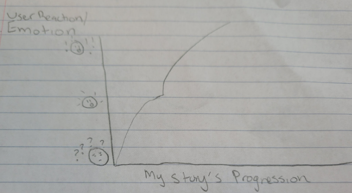

| [Home](https://mbireley.github.io/mary-bireley-portfolio/) | [Data Visualization Examples](dataviz-examples.html) | [Critique by Design](critique-by-design) | [Final Project I](final-project-part-one) | [Final Project II](final-project-part-two) | [Final Project III](final-project-part-three) |

This is the proposal for my Final Project!

# Planning

## In-Class Preparation 

In class I began thinking about my project through first articulating a one-sentence summary of my project. Then I imagined what different “users” may come to my story expecting, and what my response or “call-to-action” toward these user needs would be. I finally created a “story arc,” depicting the emotional journey my users would go on throughout my story. 

### One-Sentence Summary 

This project examines how homelessness and shelter capacity have changed in the United States from 2014 to 2024, with particular focus on the changes in sheltered and unsheltered homelessness and differences across racial groups.

### User-Story: What my Audience Will Want

“As a reader, I want to see how homelessness and shelter capacity have changed over time so I can better understand the severity and different experiences of homelessness in this country.”

### Call-to-Action: How I Will Respond to Audience Wants

“As a designer, I can help my reader understand this by visualizing the changes in homelessness (and also distinguishing between sheltered versus unsheltered homelessness) over time and by using race to show how these patterns impact groups differently.”

### Story-Arc: The Emotional Journey of the Audience 

My imagined audience is local policymakers or community advocates interested in understanding homelessness and identifying ways to respond to it in their areas.  In this illustrated story-arc, you can see that I imagined my users as coming into my story with their questions and curiosities. I imagined they knew homelessness was a serious issue, but they might be unaware of how the size of the population has changed, how the population is divided, how shelter capacity has changed, and how racial groups differ. They might also not have a personal, emotional connection to the issue, at this point. So my story must first establish that emotional connection, and the scale and trajectory of homelessness in the United States, which begins to address some questions the audience arrived with. The audience will likely be shocked by the scale and magnitude of this issue, as depicted in the story-arc illustration. My story will continue to shock the audience when I add in more information regarding different ways people experience homelessness (sheltered versus unsheltered), the change in the amount of available shelter beds, and the racial differences, while simultaneously weaving in personal experiences of those impacted.

The audience will emotionally be very inquisitive and ready to learn at the beginning, and as the story progresses they will become more surprised, aware, and invested, and by the end they will have a more nuanced understanding.  They will then feel empowered to take what they have learned and use it as a starting point to engage with the issue of homelessness in their own community, after seeing how truly far-reaching it is.
 
I also hope to give this story a very human dimension, so users can feel more emotionally invested. I don’t want them to see these people experiencing homelessness as just data points. I might be able to accomplish this by weaving personal stories of people in these experiences into the story alongside the visualizations. The stories specific “peaks and valleys” that we spoke of in class will become more clear once I delve into the data, and they will help guide the users’ emotional journey, too. 

 

# Summary

## High-Level Summary 

This project will examine how homelessness and the availability of shelter have changed in the United States between 2014 and 2024. I want to compare the number of people experiencing homelessness with the total number of year-round available beds. This can show a broader picture of how the capacity to provide shelter to those experiencing homelessness changed alongside the overall size of the homeless population. I also want to distinguish between sheltered and unsheltered homelessness to examine how the composition of homelessness changed over time with capacity.

I also want to incorporate race into my project, examining these patterns between different racial groups. I want to explore whether changes in sheltered and unsheltered homelessness have been similar across racial groups. I can use the date I have found to show shelter capacity and the population experiencing homelessness changing alongside one another to help my users understand both the scale of homelessness and how experiences of homelessness differ across groups over time. 

# Outline

## Story Structure Outline

Following the story structure outlined in Chapter 8 of our Good Charts textbook, I plan to organize my story around a setup (“some reality"), conflict (“new information that affects reality”), and resolution (“some new reality").

# Initial sketches

Based on my outline and story arc, I created sketches with paper and pencil to show the flow of my story and the anticipated data visualizations I will create. 

# The Data

My two primary data sources come from the U.S. Department of Housing and Urban Development (HUD). I am utilizing HUD’s 2007-2024 Point-in-Time (PIT) Estimates by State dataset, and its 2007-2024 Housing Inventory Count (HIC) by State dataset. Both datasets can be found on HUD’s website [here](https://www.huduser.gov/portal/datasets/ahar/2024-ahar-part-1-pit-estimates-of-homelessness-in-the-us.html)

The PIT Count dataset provides estimates of the number of people experiencing homelessness on a single night in January, and the data distinguishes between people experiencing sheltered and unsheltered homelessness. The dataset also provides demographic information for some years. I will focus on the years 2014-2024 of this dataset to examine changes in the overall number of people experiencing homelessness and to compare sheltered versus unsheltered homelessness. I will also use the demographic data on race to explore differences across racial groups. 

The HIC dataset provides information about what housing and shelter is available for people experiencing homelessness. I will use this dataset to specifically examine changes in the number of year-round beds, which is what the data calls emergency shelters, transitional housing, and safe havens, between 2014 and 2024. Using these two datasets together allows me to examine changes in the number of people experiencing homelessness alongside changes in available shelter capacity. 

# Method and medium

To create my visualizations for my final project, I will utilize Tableau. I hope to build upon and perfect the Tableau skills I have learned throughout the class and to further develop my minimalistic personal “design style.” 

To combine all the necessary elements and create a cohesive story, I will utilize Shorthand. This will be a new tool for me! 

# References

Berinato, Scott, Good Charts, “A Return to Teamwork,” 2023, 225-235.

Soucy, Daniel, Hall, Andrew, and Moses Joy, “State of Homelessness: 2025 Edition,” National Alliance to End Homelessness, 2025, https://endhomelessness.org/state-of-homelessness/. 
